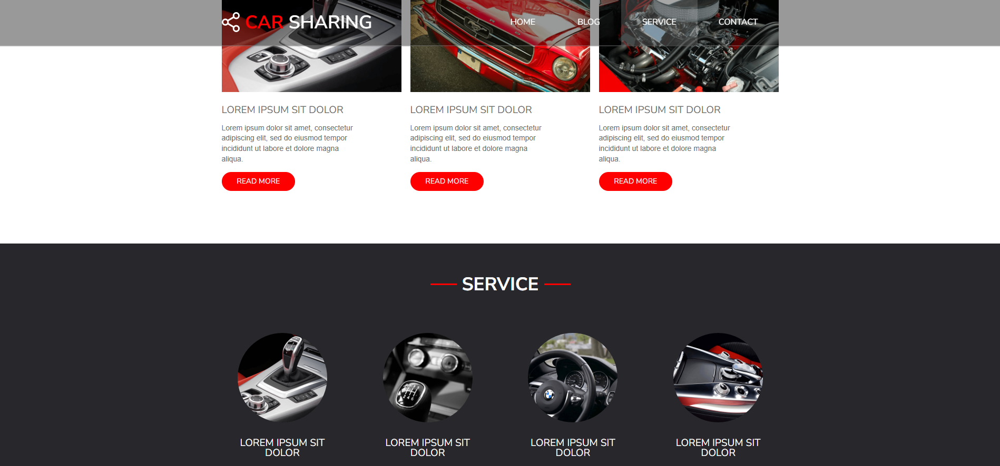
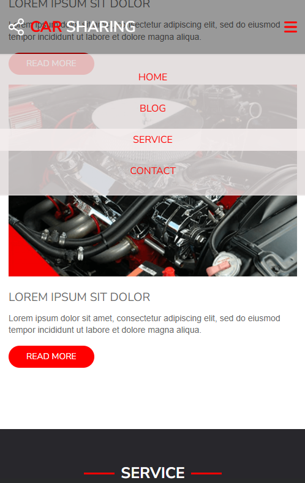

# Car Sharing

This project was created as an exercise during the JavaScript Developer course, in the advanced HTML and CSS module — building layouts from A to Z.

**Available online at:**  
[https://car-sharing-project.netlify.app/](https://car-sharing-project.netlify.app/)

## 🚀 Features

- Basic layout and UI design
- Responsive interface

## 📸 Screenshots

Below are example screenshots of the CarSharing app on desktop and mobile devices.

  
  

  
  

## 🛠️ Technologies

- Vite
- CSS
- Responsive Web Design

---

### ⚠️ Notes on CSS and Browser Support

Due to limited support for nested CSS rules in browsers released before December 2023, media query rules are written in classic syntax outside of nested blocks to ensure maximum compatibility.

---

## 🔧 Local Installation

1. **Create a local folder named `car-sharing` on your device**

   This will be the place to copy the repository.

2. **Clone the application into the created folder**

   Use the command `git clone` to download the repository:

   `git clone https://github.com/Your-Account/CarSharing.git`

3. **Navigate to the main folder in the terminal**

   Go to the project directory to be able to run npm commands:

   `cd CarSharing`

4. **Install the application**

   Install all required dependencies:

   `npm install`

5. **Run the app in development mode**

   To run the app in dev mode, use:

   `npm run dev`

6. **Build the app for production (optional)**

   Prepare the app for deployment in production:

   `npm run build`

## 🧾 Usage Instructions

⚠️ This project is a course exercise and is not a fully functional application. 

For now, you can:

- Explore the UI and layout,
- Navigate through example sections,
- Get familiar with the project structure.